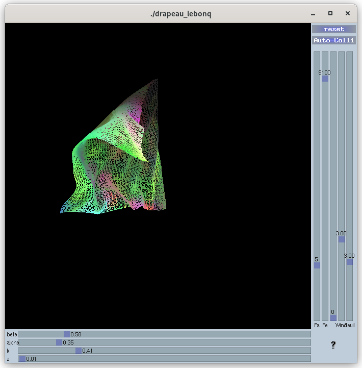
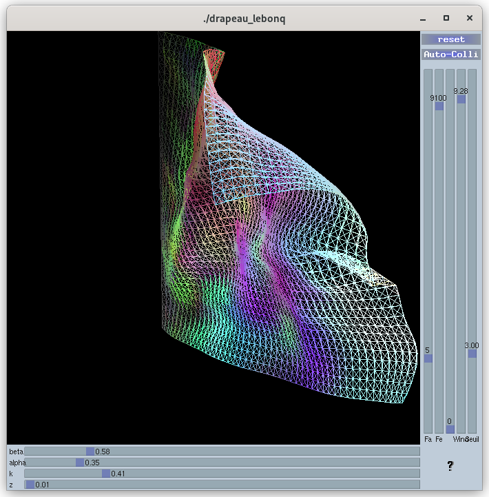
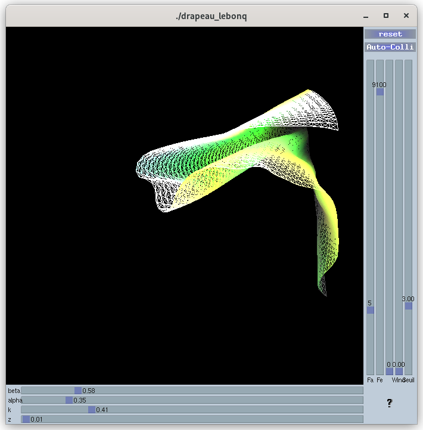
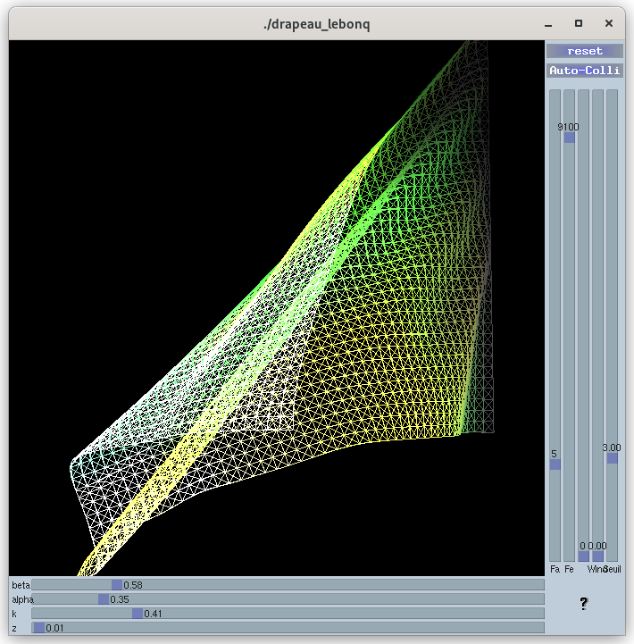
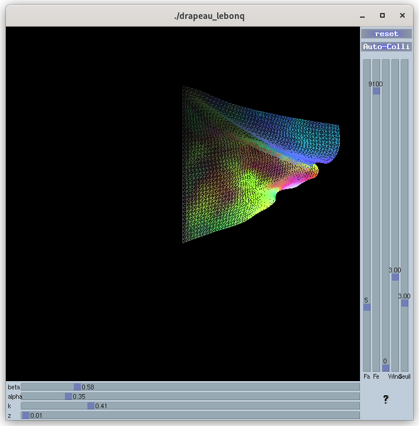
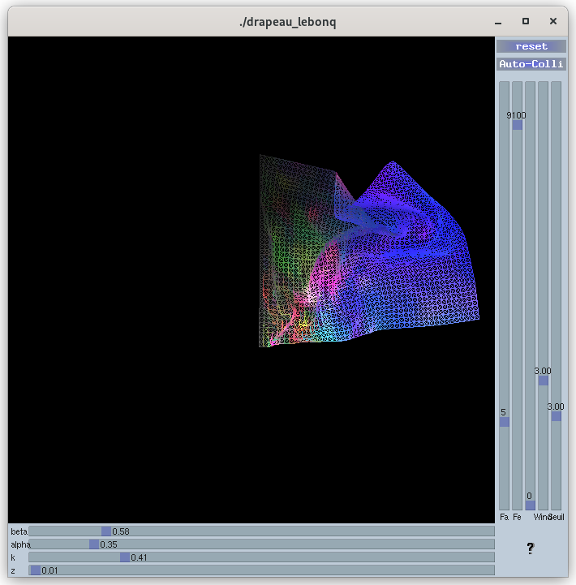

# Simulation de drapeau
### Via un système masse-ressort

## Librairies

Cette simulation fonctionne uniquement via LIBGX3D, elle doit être installée si vous voulez compiler.

## Compilation

Sous linux simple make produit un exécutable `drapeau_lebonq`

Non testé sous Windows et MacOS

## Utilisation

Le programme se lance avec la commande `./drapeau_lebonq`. Il ne prend aucun paraemètre.

## Paramètre de simulation

### Horizontal

La constante de raideur k et la viscositée mu sont modifiables via l'interface. Elle controle directement le maillage geometrique du drapeau.

Les facteurs alpha et beta controlent respectivement les valeurs de k et z pour le maillage de courbure et de torsion.

### Vertical

Fa : frequence d'affichage

Fe : frequence d'echantillonage

Wind : permet de controler la force du vent

Slider sans nom est le nombre de liaison rompu lors de l'initialisation. (cela permet d'avoir un drapeau abime des le debut)

Seuil : le seuil de force auquel les liaisons sont rompues.

### Taille du drapeau et du maillage de collision

La drapeau contient 50*40 particules. Le maillage lui contient 8 000 000 de cellules.

## Elements implementes

### Maillages

Les trois types de maillages ont ete implémenté. Le maillage géométrique, de courbure et de torsion.
Chacun est stocker dans son propre tableau pour une gestion plus simple des liens.

### Gravité 

La gravité est un ensemble de lien qui est applique sur chaque masse. ce lien est une force constante.

### Vent

A l'instar de la gravité le vent est aussi un ensemble de lien constant. Le vecteur de la force est modulé aléatoirement (voir ligne 401) pour donner du mouvement au drapeau.

### Déchirure

Pour implémenter la déchirure nous avons utilisé un seuil de force. Si la force appliqué sur une liaison est supérieur au seuil alors la liaison est rompue. Elle n'est plus affiché et n'est plus prise en compte dans les calculs.

### Auto-collision

L'auto-collision est géré via un maillage de collision.
La réaction des collisions est geré par liaison conditionnelle. Lorsque le mailliage detecte 2 particules dans une cellule il declenche de calcul de la réaction de la collision, cela permet d'éviter de calculer en permanence les collisions entre toutes les particules.

## Point d'amélioration 

### Auto-collision (fonctionne mal)

L'auto-collision est géré via un maillage de collision qui est beaucoup trop grand. Il faudrait trouver un moyen de le réduire pour gagner en performance.

De plus la réaction de collision est très simple, et le rendu n'est pas satisfaisant. Nous pourrions utiliser la dynamique inverse pour des résultats plus réaliste.

### GPU

Passer tout les calculs sur GPU nous permettrait de gagner en performance. Nous pourrions utiliser CUDA pour cela. Cela nous permettrai d'augenter le nombre de masse dans le drapeau pour un meilleur rendu.

## Vidéo

https://youtu.be/8T_YyeyOHtE

Lien vers la vidéo sur Youtube, cette video a ete prise avant la mise en place de l'auto-collision. Je ne peux malheuresment pas enregistrer une nouvelle video car ma configuration ne me le permet pas.

### Images

